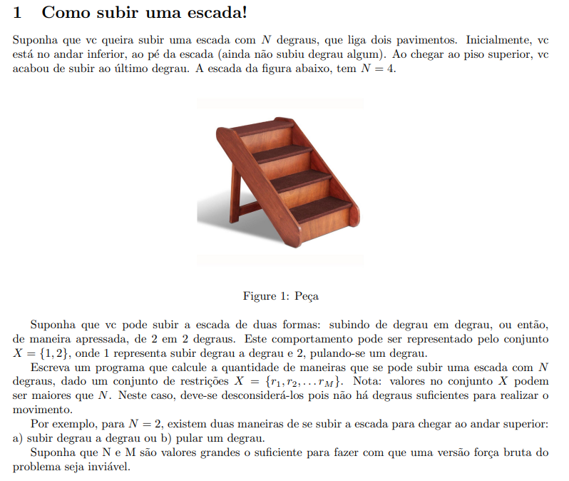

# Subindo a Escada!
## Enunciado


## Abordagem
Este código tem como o objetivo implementar o problema acima através da abordagem da Programação Dinâmica.
Para isso, utilizamos a técnica de memoização, que nos permite evitar cálculos repetidos para valores que já foram calculados anteriormente.

### Complexidade
- Complexidade de Tempo: O(2N)  
- Complexidade de Espaço: O(N)

## Dedução da Regra de Recorrência
Vamos considerar tanto para fins de explicação quanto dentro do código implementado as seguintes variáveis: 
- `N` --> Quantidade total de degraus a serem subidos
- `X` --> vetor(array) que possui os possíveis "movimentos", ou seja, a quantidade de degraus que podemos subir por vez.  

Para a demonstração abaixo, vamos considerar que `X = [1, 2]`:
- Partimos do caso inicial `N = 0`. Nesse caso, temos somente um movimento possível para chegarmos ao topo da escada: não nos movermos. Logo, `numeroDePossibilidades(0) = 1`.
- Para o caso `N = 1`, também temos somente um movimento possível: subir um degrau. Logo, `numeroDePossibilidades(1) = 1`.
- Para `N = 2`, podemos subir a escada de degrau em degrau ou pular o primeiro degrau. Logo, `numeroDePossibilidades(2) = 2`.

Seguindo essa lógica para outros valores de N, podemos concluir que conforme `N` aumenta, temos que a função `numeroDePossibilidades(N)` segue a sequência de Fibonacci, de modo que o resultado final é dado pela seguinte fórmula de recorrência: 

> Total de Possibilidades = fibonacci(N - X1) + fibonacci(N - X2) + ...

Onde `X1, X2, ... ` correspondem aos elementos do array `X`, ou seja, nossos possíveis movimentos.

## Casos de teste
Os casos de teste que podem ser rodados automaticamente encontram-se no arquivo `input.js`

## Executando o código
O trabalho foi implementado utilizando-se o **NodeJS**, mais especificamente na versão `v10.16.1`

Tendo o **NodeJS** instalado corretamente no computador, vá até o diretório raiz do projeto pelo terminal e execute o comando:
```
node ./ClimbingStairs.js
```
Todas as entradas e seus respectivos resultados devem ser impressos no próprio terminal.
